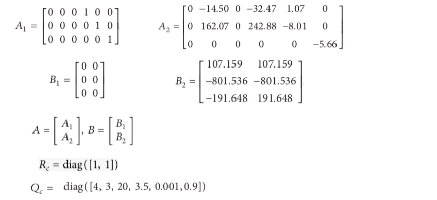
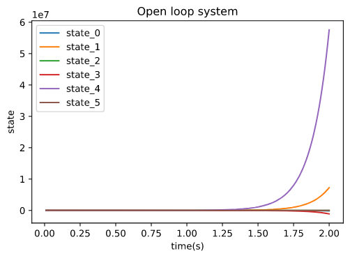
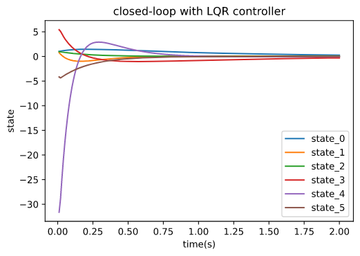
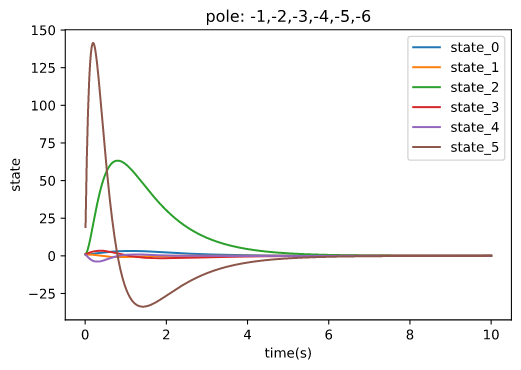
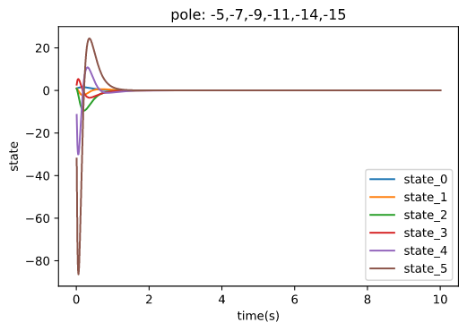
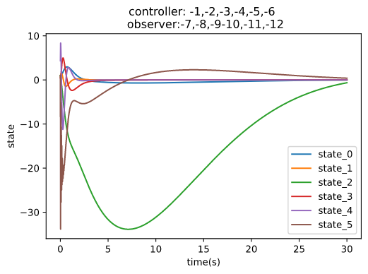
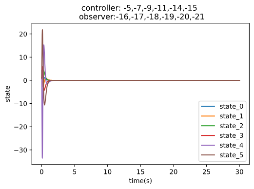

********************************
Classic Control
********************************

About
================================================================

module classiccontrol is the fundamental package needed for implementation control algorithms in  with Python.

the main object of module is LTI system and relative algorithms, controller,...
The Linear time-invariant system formulate in:

.. math:: 

    \dot{x} = Ax + Bu \\
    y = Cx + Du

This package contains:
    - **linearsystem.py**: implement class LTI and basic attributes of system, 
            - system matrix
            - dimension
            - poles of system 
            - controllability and observability:
                - Kalman standard
                - Hatus standard
            - simulation with controller and observer   
                

    - **bibo.py**: implement algorithms for determining stability of LTI system
            - Gerschgorin
            - Lyapunov
            - Hurwitz

    - **controller.py**: Design controller for LTI
            - Pole statement:
                - Roppernecker method
                - Arckerman method
                - Modal method
            - Optimal control:
                - LQR
    
    - **observer.py**: Design observer for LTI 
            - Luenberger observer
            
    
    - **utils.py**: collection of small and common Python functions which re-use a lots in difference package 

This manual contains many examples of use, usually prefixed with the Python prompt >>> (which is not a part of the example code). The examples assume that you have first entered:

.. code-block:: python

    from OpenControl import classiccontrol

Declare LTI system:

.. code-block:: python

    import numpy as np 

    A = np.array([[0,          1,    0,     0],
                  [28.0286,    0,    0,     0],
                  [0,          0,    0,     1],
                  [-1.4014,    0,    0,     0]])

    B = np.array([[    0     ],
                    -1.5873  ],
                       0     ],
                     0.6349  ]])

    C = np.array([[1,    0,    0,     0],
                  [0,    1,    0,     0],
                  [0,    0,    1,     0],
                  [0,    0,    0,     1]])

    sys = classiccontrol.linearsystem.LTI(A=A, B=B, C=C)

Controllability and observability
================================================================

Kalman standard:
    **Theorem**: The linear continuous-time system is controllable if and only if the controllability matrix has full rank.

    The observability matrix, in this case, defined by:

    **Theorem**: The linear continuous-time system is controllable if and only if the controllability matrix has full rank.

    The controllability matrix, in this case, defined by:

Hatus standard: 
    System is controllable if matrix: is full rank with any s.

.. math::
    Rank(sI - A, B) = n

    System is observable if matrix:  is full rank 

Stability
================================================================

Gerschgorin: 
    A is system matrix. Elements of A, aij. 

.. math::

    Ri(A) = \sum_{j=1, j\neq i}|a_{ij}

Hurwitz: 
    system is stable if all the eigen values of system matrix on the left of complex coordinate

Lyapunov:
    a) A is hurwitz, If there exist a positive definite squad matrix :math:`Q=Q^T` such that :math:`P=-(QA + A^TQ)` is a positive definite matrix
    b) A is hurwitz ,If there exist a positive definite squad matrix :math:`P=P^T` such that 
    equation :math:`P=-(QA + A^TQ)` got a solution :math:`Q` and Q is positive definite squad matrix

Stability of system:

.. code-block:: python

    #select the algorithms 

    sys.is_stable(algorimth='gerschgorin')
    sys.is_stable(algorimth='hurwitz')
    sys.is_stable(algorimth='lyapunov')
    

Code examples 1
================================================================

This experiment from the paper 'Observer-Based Controllers for Two-Wheeled Inverted Robots with Unknown Input Disturbance and Model Uncertainty'
Declare LTI system:

.. code-block:: python

    import numpy as np 

    A = np.array([[0,          1,    0,     0],
                  [28.0286,    0,    0,     0],
                  [0,          0,    0,     1],
                  [-1.4014,    0,    0,     0]])

    B = np.array([[    0     ],
                    -1.5873  ],
                       0     ],
                     0.6349  ]])

    C = np.array([[1,    0,    0,     0],
                  [0,    1,    0,     0],
                  [0,    0,    1,     0],
                  [0,    0,    0,     1]])

    sys = classiccontrol.linearsystem.LTI(A=A, B=B, C=C)

Basic attribute of LTI system.

.. code-block:: python

    stability = sys.is_stable()
    controllability =sys.controllable()
    observability = sys.observable()
    poles = sys.eigvals()

simulate Open-loop system.

.. code-block:: python

    sys.setup_simulink(max_step=1e-3, algo='RK45', t_sim=(0,10), x0=None, sample_time = 1e-2,z0=None)
    time_array,state,output = sys.step_response()

Design controller

.. code-block:: python

    controller = classiccontrol.controller.PoleStatement(pole=[-3,-4,-5,-6], system=sys)
    R = controller.compute()

Design observer 

.. code-block:: python

    observer = classiccontrol.observer.Luenberger(pole=[-3,-4,-5,-6], system=sys)
    L = observer.compute()

simulate Closed-loop system with state-feedback controller R

.. code-block:: python

    sys.setup_simulink()
    time_array,state,output,state_obs = sys.apply_state_feedback(R)

simulate Closed-loop system with output-feedback L-R 

.. code-block:: python

    sys.setup_simulink()
    time_array,state,output,state_obs = sys.apply_output_feedback(L,R)

Code examples 2
================================================================

simulate a Two-Wheeled Inverted Rotbots.
cited in the `paper`_ ‘Observer-Based Controllers for Two-Wheeled Inverted Robots with Unknown Input Disturbance and Model Uncertainty’

.. _`paper`: https://www.researchgate.net/publication/342700374_Observer-Based_Controllers_for_Two-Wheeled_Inverted_Robots_with_Unknown_Input_Disturbance_and_Model_Uncertainty

object got the folowing parameters:

Simulate behavior of open-loop system
Design LQR controller
Simulate behavior of closed-loop system with LQR controller 

.. code-block:: python

    import numpy as np 
    from OpenControl import classiccontrol
    A = np.array([0,0,0,1,0,0,0,0,0,0,1,0,0,0,0,
            0,0,1,0,-14.5,0,-32.47,1.07,0,0,162.07,
            0,242.88,-8.01,0,0,0,0,0,0,-5.66]).reshape(6,6)
    B = np.array([0,0,0,0,0,0,107.159,107.159,-801.536,
            -801.536,-191.648,191.648]).reshape(6,2)
    C = np.eye(6)
    Q = np.diag([4,3,20,3.5,0.001,0.9])
    R = np.diag([1,1])
    sys = classiccontrol.linearsystem.LTI(A=A,B=B,C=C)
    ctl = classiccontrol.controller.LQR(sys,Q,R)
    R = ctl.compute()
    sys.setup_simulink(t_sim=(0,2))
    time_array, state,output = sys.step_response()
    time_array2, state2,output2 = sys.apply_state_feedback(R)

Design and simulate pole-statement controller 1 with pre-define poles : -1,-2,-3,-4,-5,-6
Design and simulate pole-statement controller 2 with pre-define poles : -5,-7,-9,-11,-14,-15
Design Luenberger observer with pre-define poles : -7,-8,-9,-10,-11,-12
Design Luenberger observer with pre-define poles : -16,-17,-18,-19,-20,-21

.. code-block:: python

    ctl_1 = classiccontrol.controller.PoleStatement(pole=[-1,-2,-3,-4,-5,-6],system=sys)
    R1 =ctl_1.compute()
    obs_1 = classiccontrol.observer.Luenberger(pole=[-7,-8,-9,-10,-11,-12],system=sys)
    L1 = obs_1.compute()
    ctl_2 = classiccontrol.controller.PoleStatement(pole=[-5,-7,-9,-11,-14,-15],system=sys)
    R2 =ctl_2.compute()
    obs_2 = classiccontrol.observer.Luenberger(pole=[-16,-17,-18,-19,-20,-21],system=sys)
    L2 = obs_2.compute()
    sys.setup_simulink(t_sim=(0,50))#,x0=np.random.randint(-1,1,(6,1)))
    time_array1, state1,output1 = sys.apply_output_feedback(L1,R1)
    time_array2, state2,output2 = sys.apply_output_feedback(L1,R1)
    time_array3, state3,output3,z0 = sys.apply_output_feedback(L1,R1)
    time_array4, state4,output4,z1 = sys.apply_output_feedback(L2,R2)

