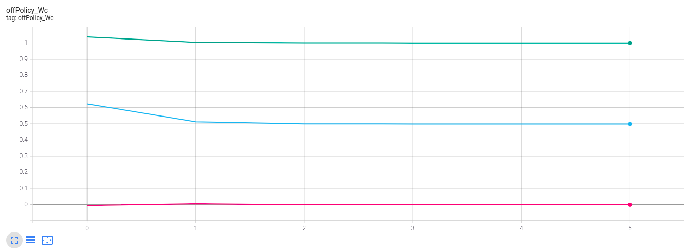

********************
Examples
********************

The below examples is given in the `paper`_ *Neural network approach to continuous-time direct adaptive optimal control for partially unknown nonlinear systems*, the full source code is provided in `here`_

.. _`paper`: https://www.sciencedirect.com/science/article/abs/pii/S0893608009000446

.. _`here`: https://github.com/VNOpenAI/OpenControl/blob/master/examples/vrabie2009.py

Check out the other examples at https://github.com/VNOpenAI/OpenControl/tree/master/examples

.. note::

    In this python implementation, we dont use the algorithm in the paper because the original one requires knowledge the system dynamics. Instead, we simulate with OpenControl, Off Policy ADP Controller. The results that is the same as the paper's results demonstrate our python packages.

Problem statements & Implementation
===============================================================

Consider the nonlinear system described be the equations:

.. math:: 
    &\dot{x_1} = -x_1 + x_2 \\
    &\dot{x_2} = -\frac{1}{2} (x_1 + x_2) + \frac{1}{2} x_2 sin^2 (x_1) + sin(x_1)u

Define the system by code

.. code-block:: python

    # define system
    def dot_x(t,x,u):
    # dynamic of the system
    x1 = x[0]
    x2 = x[1]

    # coefficient   

    # system dynamics
    dx1 = -x1 + x2
    dx2 = -0.5*(x1+x2)+0.5*x2*np.sin(x1)**2 + np.sin(x1)*u

    dx = [dx1, dx2]
    return dx

    dimension = (2,1)
    sys = NonLin(dot_x, dimension)

    # setup simulation
    t_start = 0; t_stop = 20
    x0 = np.array([-1, 1])
    sample_time = 0.01

    sys.setSimulationParam(t_sim=(t_start, t_stop), sample_time=sample_time, x0=x0)

The cost function :math:`V(x) = \int_t^\infty (x_1^2 + x_2^2 + u^2) d\tau` is approximated by the neural network which has basis function is :math:`\phi(x) = [x_1^2 + x_1x_2 + x_2^2]^T`. The initial stabilizing controller was taken as :math:`u_0(x) = -\frac{3}{2} sin(x_1) (x_1 + x_2)` applied for 30 time intervals :math:`T = 0.1 s`. 

Design controller in code:

.. code-block:: python

    # define and setup controller
    ctrl = NonLinController(sys)
    u0 = lambda x: -1.5*np.sin(x[0])*(x[0] + x[1])
    data_eval = 0.1; num_data = 30
    explore_noise = lambda t: 0.2*np.sum(np.sin(np.array([1, 3, 7, 11, 13, 15])*t))

    phi_func = lambda x: np.array([x[0]**2, x[0]*x[1], x[1]**2])

    ctrl.setPolicyParam(data_eval=data_eval, num_data=num_data, explore_noise=explore_noise, u0=u0, phi_func=phi_func)

Then run the simulation:

.. code-block:: python

    # run simuilation
    Wc, Wa = ctrl.offPolicy()
    print("The optimal weight of the critic")
    print(Wc)
    # for visualizing the results, using tensorboard

Analysis simulation with Tensorboard

For quick run, see the `notebook file`_

.. _`notebook file`: https://colab.research.google.com/drive/1SpxFHTQYXUFKXTJ1PKD6SaqQKobFxJY7?usp=sharing