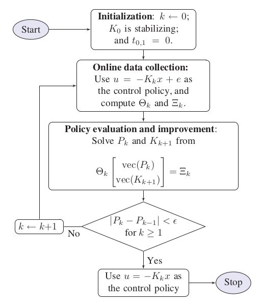
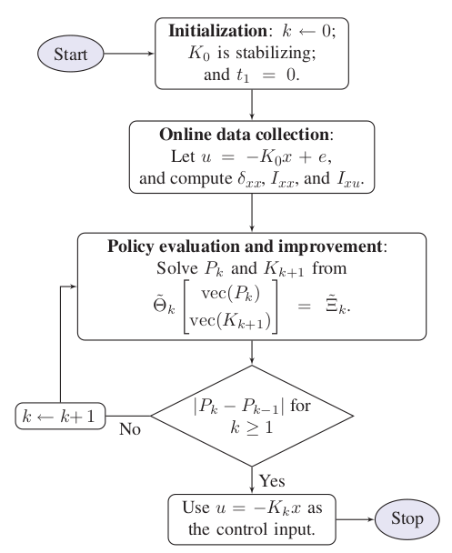

*************************
Linear ADP Controller
*************************

Problem statements
================================================================

Given the linear system equation :eq:`LTI`, design a linear quadratic regulator (LQR) in the form of :math:`u=-Kx` that minimizes the following cost function 

.. math::

    V(x) = \int_t^\infty (x^TQx+u^TRu)d\tau = x^TPx

where :math:`Q=Q^T \geq 0, R=R^T > 0`. 

The solution of this problem is :math:`K*` which is also the solution of the `Riccati equation`_, can be obtained by :func:`OpenControl.ADP_control.LTIController.LQR`. However, this approach requires the knowledge of the system dynamic (the matrix ``A`` and ``B``). The **model-free** approach below will resolve this problem.

.. _`Riccati equation`: https://en.wikipedia.org/wiki/Algebraic_Riccati_equation

Lets begin with another control policy :math:`u=-K_kx+e` where the time-varying signal e denotes an artificial noise, known as the ``exploration noise``. Taking time derivative of the cost function and integrate it within interval :math:`[t,t+\delta t]` to obtain:

.. math:: 
    x^T(t+\delta t) P_k x(t+\delta t) - x^T(t) P_k x(t) -2\int_t^{t+\delta t}e^T R K_{k+1} x d\tau = -\int_t^{t+\delta t}x^T Q_k x d\tau
    :label: fixpoint

| where :math:`Q_k=Q+K_k^T R K_k`.
| We can see that this is the fix point equation, meaning that the K matrix can be solve by finite number of iteration. And because of no requirement of the system dynamic, it is a **data-driven** approach.

On-policy learning
================================

For computational simplicity, we rewrite :eq:`fixpoint` in the following matrix form:

.. math:: 
    \Theta_k \begin{bmatrix} vec(P_k) \\ vec(K_{k+1} \end{bmatrix} = \Xi_k
    :label: matrixForm

where 

.. math:: 

    & \Theta_k =  \begin{bmatrix} 
    x^T \otimes x^T |_{t_{k,1}}^{t_{k,1+\delta t}} \hspace{1cm} -2\int_{t_{k,1}}^{t_{k,1+\delta t}}(x^T \otimes e^TR)dt  

    x^T \otimes x^T |_{t_{k,2}}^{t_{k,2+\delta t}} \hspace{1cm} -2\int_{t_{k,2}}^{t_{k,2+\delta t}}(x^T \otimes e^TR)dt  

    \vdots \hspace{1cm} \vdots

    x^T \otimes x^T |_{t_{k,l}}^{t_{k,l+\delta t}} \hspace{1cm} -2\int_{t_{k,l}}^{t_{k,l+\delta t}}(x^T \otimes e^TR)dt  \\
                                
                \end{bmatrix},

    \vspace{5mm}

    & \Xi_k = \begin{bmatrix}
    -\int_{t_{k,1}}^{t_{k,1+\delta t}}x^T Q_k x dt

    -\int_{t_{k,2}}^{t_{k,2+\delta t}}x^T Q_k x dt

    \vdots

    -\int_{t_{k,l}}^{t_{k,l+\delta t}}x^T Q_k x dt
                \end{bmatrix}

.. note::
    - To adopt the `persistent excitation` condition, one must choose a sufficiently large  ``number of data`` :math:`l>0` to satisfy the following condition:

    .. math::
        rank(\Theta_k) = \frac{n(n+1)}{2} + mn

    - In practical, :math:`l \geq n(n+1) + 2mn`
    - The time interval for each learning section is :math:`l \cdot \delta t`, so properly set :attr:`OpenControl.ADP_control.LTIController.num_data` and :attr:`OpenControl.ADP_control.LTIController.data_eval` to make sure the learning section not too slow
  
Algorithm
----------------------------------------------------------------

Library Usage
----------------------------------------------------------------

Setup a simulation _`section` with :class:`OpenControl.ADP_control.LTIController` and :func:`OpenControl.ADP_control.LTIController.setPolicyParam` then perform simulation by :func:`OpenControl.ADP_control.LTIController.onPolicy`

.. code-block:: python

    from OpenControl.ADP_control import LTIController

    Ctrl = LTIController(sys)
    # set parameters for policy
    Q = np.eye(3); R = np.array([[1]]); K0 = np.zeros((1,3))
    explore_noise=lambda t: 2*np.sin(10*t)
    data_eval = 0.1; num_data = 10

    Ctrl.setPolicyParam(K0=K0, Q=Q, R=R, data_eval=data_eval, num_data=num_data, explore_noise=explore_noise)
    # take simulation and get the results
    K, P = Ctrl.onPolicy()

Off-policy learning 
================================

Let define some new matrices

.. math::
    & \delta _{xx} = \begin{bmatrix} x\otimes x|_{t_1}^{t_1+\delta t},  & x\otimes x|_{t_2}^{t_2+\delta t}, & ..., & x\otimes x|_{t_l}^{t_l+\delta t} \end{bmatrix} ^T

    \vspace{5mm}

    &I_{xx} = \begin{bmatrix} \int_{t_1}^{t_1+\delta t}x\otimes xd\tau, & \int_{t_2}^{t_2+\delta t}x\otimes xd\tau, &..., & \int_{t_l}^{t_l+\delta t}x\otimes xd\tau \end{bmatrix} ^T

    \vspace{5mm}

    &I_{xu} = \begin{bmatrix} \int_{t_1}^{t_1+\delta t}x\otimes u_0d\tau, & \int_{t_2}^{t_2+\delta t}x\otimes u_0d\tau, &..., & \int_{t_l}^{t_l+\delta t}x\otimes u_0d\tau \end{bmatrix} ^T

and :math:`\Theta_k \in \mathbb{R}^{l\times (nn+mn)}, \Xi_k\in \mathbb{R}^l` defined by: 

.. math:: 
    & \Theta_k = \begin{bmatrix} \delta_{xx}, & -2I_{xx}(I_n\otimes K_k^T R) - 2I_{xu}(I_n\otimes R) \end{bmatrix}    \\
    & \Xi_k = -I_{xx}vec(Q_k)

then for any given stabilizing gain matrix :math:`K_k`, :eq:`fixpoint` implies the same matrix form as :eq:`matrixForm`

Algorithm
----------------------------------------------------------------

Library Usage
----------------------------------------------------------------

Setup a simulation section the same as the `section`_ then perform simulation by :func:`OpenControl.ADP_control.LTIController.offPolicy`

.. code-block:: python

    K, P = Ctrl.offPolicy()

.. autoclass:: OpenControl.ADP_control.LTIController
    :members:
    :undoc-members:
    :show-inheritance:
    :special-members: __init__
