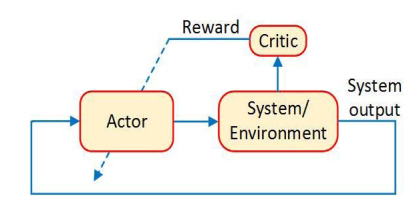

*************************
Non-Linear ADP Controller
*************************

The below algorithms is given in the book `Robust Adaptive Dynamic Programming`_.

.. _`Robust Adaptive Dynamic Programming`: https://www.wiley.com/en-us/Robust+Adaptive+Dynamic+Programming-p-9781119132646

Problem statements
================================================================

Given the nonlinear system equation :eq:`nonLin`, design a control policy :math:`u(t)` that minimize the following cost function:

.. math::
    V(x) = \int_0^\infty r(x(t),u(t))dt, \hspace{1cm} x(0)=x_0
    :label: costFunc

where :math:`r(x,u)=q(x)+u^TR(x)u` with :math:`q(x)` a positive definite function, and :math:`R(x)` is symmetric and positive definite for all :math:`x \in \mathbb{R}^n`

If there exists a feedback control policy :math:`u_0: \mathbb{R}^n \rightarrow \mathbb{R}^m` that globally asymtotically stabilizes the system :eq:`nonLin` at the origin and the associated cost as defined in :eq:`costFunc` and there exists a continous differentiable function :math:`V^*` such that the `Hamilton-Jacobi-Bellman`_ (HJB) equation holds :math:`H(V^*)=0` then the control policy 

.. _`Hamilton-Jacobi-Bellman`: https://en.wikipedia.org/wiki/Hamilton%E2%80%93Jacobi%E2%80%93Bellman_equation

.. math:: 
    u^*(x) = -\frac{1}{2}R^{-1}(x)g^T(x)\nabla V^*(x)
    :label: uopt

globally asymptotically stabilizes :eq:`nonLin` at :math:`x=0`, and :math:`u^*` is also the optimal control policy 

.. math::
    V^*(x) = min_uV(x,u) \hspace{1cm}  \forall x \in \mathbb{R}^n

Off Policy Learning
===============================

Consider the system with the folowing control policy 

.. math::
    \dot{x} = f(x) + g(x)(u_0+e)
    :label: offPolSystem1

where ``u0`` is the initial admissible control policy and :math:`e` is the ``exploration noise`` then rewrite it as

.. math::
    \dot{x} = f(x) + g(x)u_i(x) + g(x)v_i
    :label: offPolSystem2

where :math:`v_i = u_0-u_i+e`. 

Take the time derivative of :math:`V_i(x)` along :eq:`offPolSystem2` and integrate the result within interval :math:`[t,t+T]` to obtain:

.. math::
    V_i(x(t+T)) - V_i(x(t)) = - \int_t^{t+T} [q(x)+u_i^TRu_i + 2u_{i+1}^TRv_i]d\tau
    :label: fixpoint2

Because the formula :eq:`uopt` requires the knowledge of the dynamic of the system, it makes practical application limited. One may use ``neural networks`` to approximate the control policy :math:`u_i` (the ``actor``)and the unknown cost function :math:`V_i(x)` (the ``critic``). 

.. math::
    V_i(x) \approx \sum_{j=1}^{N_1}Wc_{i,j}\phi_j(x)

    \vspace{5mm}

    u_{i+1}(x) \approx \sum_{j=1}^{N_2}Wa_{i,j}\psi_j(x)

where :math:`\phi_j:\mathbb{R}^n \rightarrow \mathbb{R}` and :math:`\psi_j: \mathbb{R}^n \rightarrow \mathbb{R}^m` are two sequences of linearly independent smooth basis function, :math:`Wc, Wa` is the weight of the neural networks.

Replacing them to the :eq:`fixpoint2` and transform the result into the matrix, we have

.. math::
    \begin{bmatrix} &\Delta\phi^T &-2(I_{u\psi}-I_{\psi\psi}(Wa_i^T \otimes I_\phi)) \end{bmatrix}
    \begin{bmatrix} &Wc_i^T \\ &vec(Wa_{i+1}^TR) \end{bmatrix} = 
    \begin{bmatrix} I_q+I_{\psi\psi}vec(Wa_i^TRWa_i) \end{bmatrix}
    :label: fixpoint3

where :math:`Wc_i = \begin{bmatrix} &Wc_{i,1}, &Wc_{i,2},  &..., &Wc_{i,N_2} \end{bmatrix}^T` and the same for :math:`Wa_i, \phi(x), \psi(x)` and 

.. math::
    &\Delta\phi = \phi(x(t+T)) - \phi(x(t)

    \vspace{5mm}

    &I_q = \int_t^{t+T}q(x)d\tau

    \vspace{5mm}

    &I_{u\psi} = \int_t^{t+T}(u_0+e)^T\otimes \psi^Td\tau

    \vspace{5mm}

    &I_{\psi\psi} = \int_t^{t+T}(\psi^T\otimes \psi^T)d\tau

    \vspace{5mm}

    &I_\psi = np.eye(N_2)

Finally, one can realize that the :eq:`fixpoint3` is actually a fixpoint equation in the form

.. math::
    A(w_i)C(w_{i+1}) = B(w_i)

.. note::
    - the initial controller ``u0`` must be ``admissible`` controller 
    - the squences of basis functions :math:`\phi_j(x), \psi_j(x)` should be in the form of *linearly independent smooth*. Default basis functions is the ``polynomial functions``, see :func:`OpenControl.ADP_control.NonLinController.default_psi_func` and :func:`OpenControl.ADP_control.NonLinController.default_phi_func`
    - the time interval ``T`` for data collection must be larger than the sample time
    - ``number of data`` :math:`l >= n(n+1) + 2mn`
    - the default function :math:`q(x)` is :math:`x^Tx`

Algorithm
----------------

Library Usage
----------------------

Define a non-linear system like in :doc:`system`, then setup a simulation section by :func:`OpenControl.ADP_control.NonLinController.setPolicyParam` and perform simulation by :func:`OpenControl.ADP_control.NonLinController.offPolicy`

.. code-block:: python

    from OpenControl.ADP_control import NonLinController

    ##########define a controller##################
    Ctrl = NonLinController(sys)
    u0 = lambda x: 0      # the system is already globally stable
    data_eval = 0.01; num_data = 80       # at leats n_phi+n_psi
    explore_noise = lambda t: 0.2*np.sum(np.sin(np.array([1, 3, 7, 11, 13, 15])*t)) 

    ###############setup policy parameter############
    Ctrl.setPolicyParam(data_eval=data_eval, num_data=num_data, explore_noise=explore_noise, u0=u0)
    ###############take simulation step##############
    Wc, Wa = Ctrl.offPolicy()

then the optimal control policy is given by

.. code-block:: python

    uopt = lambda t,x: Wa.dot(Ctrl.psi_func(x))

.. .. autoclass:: OpenControl.ADP_control.NonLinController
    :members:
    :undoc-members:
    :show-inheritance:
    :special-members: __init__
