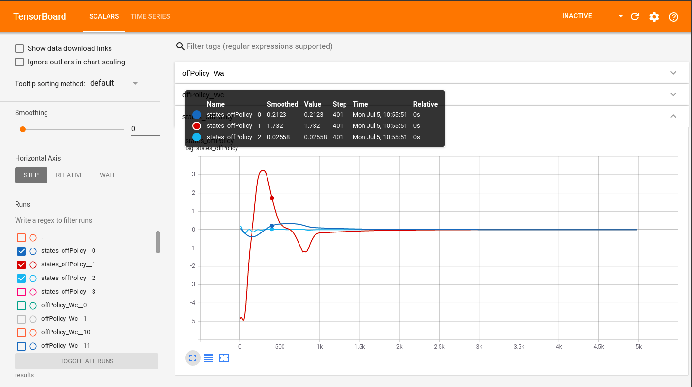

*************************
Visualize 
*************************

This class wrap the `Pytorch Tensorboard`_ class.

.. _`Pytorch Tensorboard`: https://pytorch.org/docs/stable/tensorboard.html

Present the simulation results on `Tensorboard` is so easy and interactive with 

Create log file and log signal
================================================================

.. code-block:: python

    from OpenControl.visualize import Logger
    
    logX = Logger(log_dir='results')
    for i in range(100):
        logX.log('euler', [i*np.cos(i), i*np.sin(i)], i)
    logX.end_log()

Analysis simulation on Tensorboard
================================================================

.. note::
    If you run the code on Google Colab shell, just load Tensorboard first

    .. code-block:: python

        %load_ext tensorboard

    then run this shell to show 

    .. code-block:: python

        %tensorboard --logdir results

Usage
================================

    

.. autoclass:: OpenControl.visualize.Logger
    :members:
    :undoc-members:
    :show-inheritance:
    :special-members: __init__
